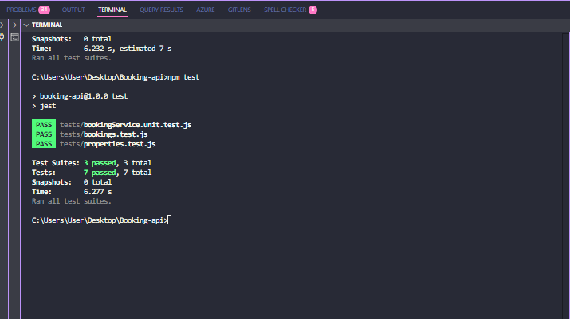

# Booking API

A simple property rental backend API (like Airbnb/Booking.com) built with Node.js, Express, Sequelize, and PostgreSQL.


## Features
- List properties
- View property availability
- Create/cancel bookings
- Date validation and overlap checks
- Unit/integration tests
- Swagger/OpenAPI documentation at `/api-docs`

## Setup Instructions
1. Clone this repo or unzip the folder.
2. Install dependencies:
   ```sh
   npm install
   ```
3. Configure your PostgreSQL database in `.env` (see `.env.example`).
4. Start the server (auto-seeds demo properties if empty):
   ```sh
   npm run dev
   ```

## Testing
Run all tests:
```sh
npm test
```

## API Endpoints

### Properties

#### `GET /properties`
Returns a paginated list of all properties.
- **Query params:**
  - `page` (optional, default: 1)
  - `limit` (optional, default: 10)
  - `available_from`, `available_to` (optional, filter by date range)
- **Response:**
  ```json
  {
    "total": 2,
    "page": 1,
    "pageSize": 10,
    "properties": [
      {
        "id": 1,
        "title": "Cozy Cabin",
        "description": "A nice cabin in the woods",
        "price_per_night": 100,
        "available_from": "2025-08-10",
        "available_to": "2025-08-20"
      },
      ...
    ]
  }
  ```

#### `GET /properties/:id/availability`
Returns available date ranges for a specific property.
- **Response:**
  ```json
  {
    "property_id": 1,
    "available": [
      { "from": "2025-08-10", "to": "2025-08-12" },
      { "from": "2025-08-16", "to": "2025-08-20" }
    ]
  }
  ```

### Bookings

#### `POST /bookings`
Creates a new booking for a property.
- **Body:**
  ```json
  {
    "property_id": 1,
    "user_name": "John Doe",
    "start_date": "2025-08-15",
    "end_date": "2025-08-18"
  }
  ```
- **Validations:**
  - Dates must be within property availability.
  - Dates must not overlap with existing bookings.
  - `start_date` must be before `end_date`.
- **Response:**
  - `201 Created` with booking object, or `400` with error message.

#### `DELETE /bookings/:id`
Cancels (deletes) a booking by ID.
- **Response:**
  - `200 OK` with confirmation, or `404` if not found.

#### `PUT /bookings/:id`
Updates a booking (bonus).
- **Body:**
  ```json
  {
    "start_date": "2025-08-16",
    "end_date": "2025-08-18"
  }
  ```
- **Response:**
  - `200 OK` with updated booking, or `400`/`404` on error.

## API Documentation
- Interactive docs available at [`/api-docs`](http://localhost:3000/api-docs) (Swagger UI)

## Notes
- All dates use `YYYY-MM-DD` format.
- Bookings cannot overlap or be outside property availability.
- See code comments for more details.
- Demo properties are auto-seeded on first run if the database is empty.

## Test Cases

### Integration Tests

- **GET /properties**
  - Should return a list of all properties (status 200, non-empty array).
- **GET /properties/:id/availability**
  - Should return the availability for a property (status 200, correct property_id, array of available ranges).
- **POST /bookings**
  - Should create a booking with valid data (status 201, correct user_name).
  - Should not allow overlapping bookings (status 400, error message about overlap).
- **DELETE /bookings/:id**
  - Should delete a booking (status 200, confirmation message).

### Unit Tests (Booking Service)

- Should create a booking with valid data (returns booking object with correct user_name).
- Should not allow overlapping bookings (throws error with overlap message).

### How to Run

Run all tests:
```sh
npm test
```

All tests are located in the `tests/` directory and cover both HTTP endpoints and core service logic.


## Demo & Test Results

- **Test Results Screenshot:** 


